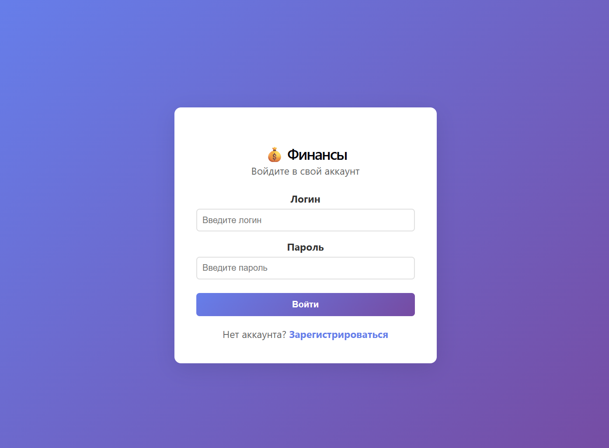
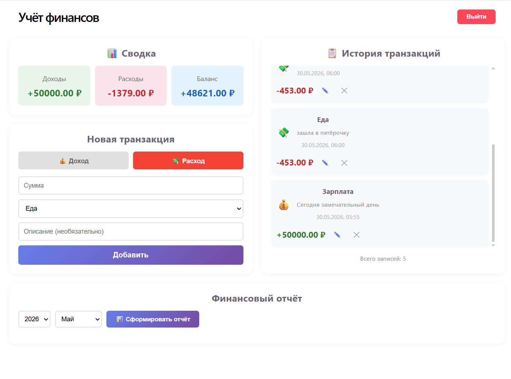
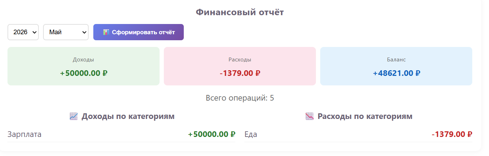

# Учёт финансов

Веб-приложение для учёта личных финансов с возможностью добавления, редактирования, удаления транзакций и формирования месячных отчётов.

---
## Автор
Шилинцева Татьяна - https://github.com/tanya-is-anywhere

## Содержание

- [Стек технологий](#стек-технологий)
- [Функционал](#функционал)
- [Установка и запуск](#установка-и-запуск)
- [Структура проекта](#структура-проекта)
- [API](#api)
- [Скриншоты](#скриншоты)
- [Запуск тестов](#запуск-тестов)
- [Docker Compose](#создание-и-запуск-приложения-через-docker-compose)

---

## Стек технологий

### Backend
| Технология | Версия | Назначение |
|------------|--------|------------|
| Python | 3.12 | Язык программирования |
| Flask | 3.1.3 | Веб-фреймворк |
| SQLAlchemy | 2.0.49 | ORM для работы с БД |
| Flask-SQLAlchemy | 3.1.1 | Интеграция SQLAlchemy с Flask |
| Flask-JWT-Extended | 4.7.1 | JWT-аутентификация |
| Flask-CORS | 6.0.2 | Cross-Origin Resource Sharing |
| Flask-Marshmallow | 1.5.0 | Сериализация данных |
| psycopg2-binary | 2.9.11 | Драйвер PostgreSQL |
| PostgreSQL | 16+ | База данных |

### Frontend
| Технология | Версия | Назначение |
|------------|--------|------------|
| React | 19+ | UI-библиотека |
| Vite | 8+ | Сборщик проекта |
| React Router DOM | 7+ | Роутинг |
| Axios | 1+ | HTTP-клиент |

### Инструменты разработки
| Инструмент | Назначение |
|------------|------------|
| DBeaver    | Управление базой данных |
| Postman    | Тестирование API |
| PyCharm    | Редактор кода |

---

## Функционал

### Аутентификация
- Регистрация нового пользователя
- Вход в систему (JWT-токен)
- Защита API от неавторизованного доступа

### Транзакции (CRUD)
- Добавление доходов/расходов
- Выбор категории из предустановленного списка
- Редактирование существующих транзакций
- Удаление транзакций
- Просмотр истории с прокруткой

### Отчёты
- Сводка доходов/расходов/баланса
- Месячный отчёт по категориям
- Детализация доходов и расходов

---

## Установка и запуск

### Предварительные требования

- Python 3.10+
- Node.js 18+
- PostgreSQL 14+
- npm 9+
- Скопируйте файл [.env.example](backend%2F.env.example), задав ему название просто .env
- Заполните недостающие переменные внутри этого файла согласно данным, которые вы вносили при регистрации пользователя в PostgreSQL 
### 1. Клонирование репозитория

```bash
git clone https://github.com/tanya-is-anywhere/Small_projects.git
cd FinancePythonApp
```
### 2. Выполните SQL скрипт для создания базы данных внутри редактора (использовала DBeaver)

```
Скрипт находится в FinancePythonApp\backend\database\schema.sql
```
### 3. Установка зависимостей и запуск Backend

```bash
cd backend
python -m venv venv
venv\Scripts\activate
pip install -r requirements.txt
flask run
```
### 4. Запуск Frontend (в отдельном терминале)
```bash
cd frontend
npm install
npx vite --host --force # введите y для продолжения, как указано в подсказке
```
### 5. Перейдите по ссылке, которую вам даст vite и попадёте на страницу входа

## Структура проекта
```
finance-tracker/
│
├── backend/
│   ├── app/
│   │   ├── __init__.py          # Фабрика приложения Flask
│   │   ├── config.py            # Конфигурация (БД, JWT)
│   │   ├── models.py            # Модели SQLAlchemy
│   │   └── routes.py            # API эндпоинты
│   ├── tests/
│   │   ├── __init__.py          # Фабрика приложения Flask
│   │   ├── conftest.py              # Фикстуры pytest (клиент, БД в памяти, токены)
│   │   ├── factories.py             # Вспомогательные классы для тестирования БД
│   │   ├── test_auth.py             # Тесты аутентификации
│   │   └── test_transactions.py     # Тесты транзакций и отчётов
│   ├── .env                     # Переменные окружения
│   ├── requirements.txt         # Python-зависимости
│   └── run.py                   # Точка входа
│
├── frontend/
│   ├── src/
│   │   ├── api/
│   │   │   └── axios.jsx        # Настройка HTTP-клиента
│   │   ├── components/
│   │   │   ├── MonthlyReport.jsx       # Отчёт за месяц
│   │   │   ├── Summary.jsx             # Сводка (виджет)
│   │   │   ├── TransactionForm.jsx     # Форма добавления
│   │   │   └── TransactionList.jsx     # Список с редактированием
│   │   ├── pages/
│   │   │   ├── Dashboard.jsx    # Главная страница
│   │   │   ├── Login.jsx        # Вход
│   │   │   └── Register.jsx     # Регистрация
│   │   ├── App.jsx              # Роутинг
│   │   └── main.jsx             # Точка входа React
│   ├── index.html
│   ├── package.json
│   └── vite.config.js           # Конфигурация Vite + прокси
│
└── README.md
```

## API
### Регистрация (POST)
```chatinput
POST /api/auth/register
Content-Type: application/json

{
    "username": "user123",
    "password": "secret123"
}
```
### Вход (POST)
```chatinput
POST /api/auth/login
Content-Type: application/json

{
    "username": "user123",
    "password": "secret123"
}
```
### Получить все транзакции (GET)
Все запросы требуют заголовок: Authorization: Bearer <токен>
```chatinput
GET /api/transactions/
```
### Создать  (POST)
```chatinput
POST /api/transactions/
Content-Type: application/json

{
    "type": "expense",
    "amount": 1500.00,
    "category": "Еда",
    "description": "Ужин в ресторане"
}
```
### Удалить транзакцию (DELETE)
```chatinput
DELETE /api/transactions/1
```
### Изменить транзакцию (PUT)
```chatinput
PUT /api/transactions/1
Content-Type: application/json

{
    "amount": 2000.00,
    "category": "Развлечения"
}
```
### Скриншоты
#### Страница входа

#### Страница регистрации

#### Главная страница

#### Финансовый отчёт


## Запуск тестов
Предварительно перейдите в папку backend и активируйте виртуальное окружение
```bash
pytest tests/ -v
```
## Создание и запуск приложения через Docker Compose
### Структура Docker файлов
```
├── docker-compose.yml          # Оркестрация всех сервисов
├── .env                        # Переменные окружения (не коммитить)
├── .env.example                # Пример переменных (можно коммитить)
├── backend/
│   └── Dockerfile              # Multi-stage: тесты → продакшен
├── frontend/
│   ├── Dockerfile              # Сборка React → Nginx
│   └── nginx.conf              # Конфигурация Nginx
└── init.sql                    # Инициализация БД
```
### Запуск (для удобства - в фоновом режиме)
```bash
docker compose up -d --build
```
После запуска следует перейти на http://localhost:5173/login. Теперь можно пользоваться приложением.
### Остановка контейнера
```bash
docker compose down
```